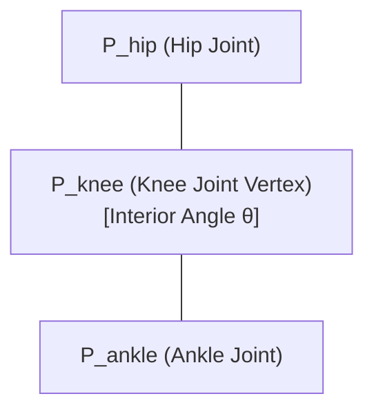
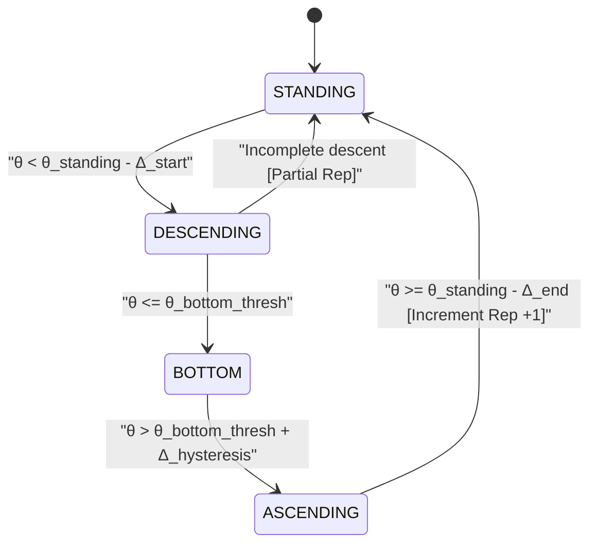

# Chapter 3: Methodology and System Architecture

## 3.1 High-Level System Architecture and Pipeline Seams

To ensure high modularity, maintainability, and testability, the proposed exercise repetition counter is organized into a five-layer architecture: `Capture → Detect → Features → Count → Present / Record`. Each layer communicates across clean architectural boundaries (seams), isolating the core mathematical feature extraction and counting logic from input/output drivers and rendering components.

The system operates across two primary deployment pathways:

1. **Live Web Mode (Client–Server Hybrid)**: Designed for real-time interactive monitoring via browser webcams [15]. To eliminate the bandwidth and latency overhead of streaming raw video frames to the server, pose detection runs locally in the browser using MediaPipe JS/WASM [1]. The browser extracts landmark coordinates and transmits lightweight JSON payloads (~1–2 KB per frame) over a WebSocket connection. The server receives these landmark streams and executes the pure Python `Features` and `Count` pipeline, returning real-time repetition counts and state updates to the user interface.
2. **Headless Batch Processing Mode**: Designed for large-scale dataset extraction and offline analysis [16]. The batch engine decodes video files server-side, distributing processing across multiple CPU worker processes via a `ProcessPoolExecutor`. It outputs a standardized dataset CSV file following a fixed column schema (`SUMMARY_FIELDS`), recording summary metrics per video (e.g., total reps, full reps, partial reps, duration, mean depth angle, min depth angle, and execution status).

---

## 3.2 Mathematical Formulation of Feature Extraction

### 3.2.1 Landmark Selection and Vector Construction
MediaPipe Tasks Vision `PoseLandmarker` outputs 33 3D anatomical keypoints per frame [1]. For squat analysis, the pipeline isolates three principal lower-body landmarks on each leg:
- **Hip Joint** ($P_{\text{hip}}$): Landmark index 23 (left hip) or 24 (right hip).
- **Knee Joint** ($P_{\text{knee}}$): Landmark index 25 (left knee) or 26 (right knee).
- **Ankle Joint** ($P_{\text{ankle}}$): Landmark index 27 (left ankle) or 28 (right ankle).

To measure lower-limb flexion, we construct two spatial 2D vectors emanating from the knee joint vertex $P_{\text{knee}}$:
1. **Thigh Vector ($\vec{u}$)**: Connecting the knee joint to the hip joint:
   $$\vec{u} = P_{\text{hip}} - P_{\text{knee}} = (x_{\text{hip}} - x_{\text{knee}}, \; y_{\text{hip}} - y_{\text{knee}})$$
2. **Shank Vector ($\vec{v}$)**: Connecting the knee joint to the ankle joint:
   $$\vec{v} = P_{\text{ankle}} - P_{\text{knee}} = (x_{\text{ankle}} - x_{\text{knee}}, \; y_{\text{ankle}} - y_{\text{knee}})$$

### 3.2.2 Interior Joint Angle Calculation
The interior joint angle $\theta$ represents the angle enclosed between the thigh vector $\vec{u}$ and the shank vector $\vec{v}$. Mathematically, the dot product of two vectors is proportional to the cosine of the angle between them:
$$\vec{u} \cdot \vec{v} = \|\vec{u}\| \|\vec{v}\| \cos(\theta)$$

Solving for $\theta$ using the inverse cosine function ($\arccos$) and converting from radians to degrees yields:
$$\theta = \arccos\left( \frac{\vec{u} \cdot \vec{v}}{\|\vec{u}\| \|\vec{v}\|} \right) \times \left(\frac{180^\circ}{\pi}\right)$$

Where:
- $\vec{u} \cdot \vec{v} = (u_x \cdot v_x) + (u_y \cdot v_y)$ is the 2D vector dot product.
- $\|\vec{u}\| = \sqrt{u_x^2 + u_y^2}$ and $\|\vec{v}\| = \sqrt{v_x^2 + v_y^2}$ are the Euclidean lengths (magnitudes) of the thigh and shank vectors.

*Intuitive Interpretation*: An upright standing athlete exhibits an extended leg where vectors $\vec{u}$ and $\vec{v}$ point in nearly opposite directions, producing an interior angle $\theta \approx 170^\circ\text{--}180^\circ$. As the athlete squats, knee flexion brings the hip and ankle closer relative to the knee vertex, decreasing $\theta$ toward $90^\circ$ (thighs parallel to the ground) or below $90^\circ$ (deep squat).

### 3.2.3 Coordinate Selection: World vs. Image Coordinates
MediaPipe provides both normalized image coordinates ($x, y \in [0, 1]$) and real-world metric coordinates ($x, y, z$ in meters) [1]. 

Following findings by Dill et al. [6] and system guidelines [14], our pipeline **prefers MediaPipe 2D world coordinates ($x, y$)** for angle calculation, falling back to 2D image coordinates only when world landmarks are unavailable. World coordinates convert pixel positions into metric space relative to the body center, removing perspective scale distortion caused by camera distance. Crucially, the monocular depth channel ($z$) is explicitly **excluded** from angle calculations, as monocular 3D depth predictions suffer from high variance compared to 2D planar keypoints [4], [6].

### 3.2.4 Multi-Leg Selection and Averaging Logic
In real-world setups, camera angles (such as a $45^\circ$ diagonal view) may cause one leg to be more visible than the other. To ensure robust feature extraction [14]:
1. The pipeline computes joint angles $\theta_{\text{left}}$ and $\theta_{\text{right}}$ independently for both legs.
2. If only one leg satisfies MediaPipe's landmark visibility confidence threshold ($\tau_{\text{vis}} = 0.5$), the system selects the angle of the visible leg.
3. When both legs are confidently detected ($\text{visibility} \ge 0.5$), the system computes the arithmetic mean:
   $$\theta_{\text{raw}} = \frac{\theta_{\text{left}} + \theta_{\text{right}}}{2}$$

### 3.2.5 Signal Smoothing via Exponential Moving Average (EMA)
Raw keypoint predictions from video frames often exhibit high-frequency landmark jitter caused by subtle lighting changes or sensor noise. Feeding raw angles directly into a state machine could cause premature state transitions.

To smooth the signal without introducing excessive phase delay, we apply a low-pass **Exponential Moving Average (EMA)** filter to the raw joint angle $\theta_{\text{raw}}$:
$$\theta_{\text{smooth}}(t) = \alpha \cdot \theta_{\text{raw}}(t) + (1 - \alpha) \cdot \theta_{\text{smooth}}(t-1)$$

Where:
- $\theta_{\text{smooth}}(t)$ is the filtered joint angle at frame $t$.
- $\alpha \in (0, 1]$ is the smoothing factor (empirically set to $\alpha = 0.4$). A lower $\alpha$ increases smoothing, while a higher $\alpha$ makes the filter more responsive to rapid movements.

---

## 3.3 Per-Session Standing Auto-Calibration Routine

A major limitation of hardcoded angle thresholds is that baseline standing posture varies across individuals due to joint mobility, posture habits, and camera mounting tilt. For example, one user's comfortable upright stand might measure $175^\circ$, while another's measures $165^\circ$.

To provide adaptive tracking [8], the system incorporates an automatic **Standing Calibration Phase** during the initial frames of a session ($N_{\text{calib}} = 15\text{--}30$ frames):

1. **Baseline Standing Angle ($\theta_{\text{standing}}$)**: The system averages the smoothed joint angles while the user stands upright prior to movement:
   $$\theta_{\text{standing}} = \frac{1}{N_{\text{calib}}} \sum_{k=1}^{N_{\text{calib}}} \theta_{\text{smooth}}(k)$$
2. **Dynamic Depth Threshold Derivation**: Rather than using static cutoffs, squat depth thresholds are established relative to the calibrated standing baseline $\theta_{\text{standing}}$:
   - **Parallel Squat Threshold ($\theta_{\text{bottom\_thresh}}$)**: Set to $58\%$ of the standing baseline, which maps an average $172^\circ$ standing posture to $\approx 100^\circ$ (thighs parallel to the ground) [2], [5]:
     $$\theta_{\text{bottom\_thresh}} = \theta_{\text{standing}} \times 0.58$$
   - **Full Squat Threshold ($\theta_{\text{full\_thresh}}$)**: Set to $52\%$ of the standing baseline, mapping to $\approx 90^\circ$ (deep squat below parallel) [2], [5]:
     $$\theta_{\text{full\_thresh}} = \theta_{\text{standing}} \times 0.52$$

---

## 3.4 Hysteresis Finite State Machine (FSM) Counting Logic

### 3.4.1 State Machine Architecture
Exercise repetition tracking is governed by a deterministic Finite State Machine (FSM) comprising four core movement states: `STANDING`, `DESCENDING`, `BOTTOM`, and `ASCENDING`.

### 3.4.2 Two-Threshold Hysteresis Rules
A common failure mode in exercise counters is "turnaround chatter." When an athlete reaches the bottom of a squat, micro-hesitations or landmark jitter can cause a single-threshold system to repeatedly cross the boundary, resulting in multiple false counts for a single squat.

To eliminate chatter, our FSM implements **two-threshold hysteresis**, establishing distinct entry and exit margins:
1. **`STANDING` $\rightarrow$ `DESCENDING`**: Initiated when the joint angle drops below the standing margin:
   $$\theta_{\text{smooth}}(t) < \theta_{\text{standing}} - \Delta_{\text{start}} \quad (\text{where } \Delta_{\text{start}} = 10^\circ)$$
2. **`DESCENDING` $\rightarrow$ `BOTTOM`**: Reached when the joint angle satisfies the parallel depth threshold:
   $$\theta_{\text{smooth}}(t) \le \theta_{\text{bottom\_thresh}}$$
3. **`BOTTOM` $\rightarrow$ `ASCENDING`**: Transition occurs only after the angle rises above the bottom threshold plus a hysteresis margin ($\Delta_{\text{hysteresis}} = 5^\circ$):
   $$\theta_{\text{smooth}}(t) > \theta_{\text{bottom\_thresh}} + \Delta_{\text{hysteresis}}$$
   *Why Hysteresis Works*: Requiring the angle to rise by an additional $+5^\circ$ before exiting `BOTTOM` state ensures that small fluctuations ($\pm 2^\circ$) at the bottom cannot trigger premature or multiple state transitions.
4. **`ASCENDING` $\rightarrow$ `STANDING`**: Completed when the athlete returns to the upright standing range:
   $$\theta_{\text{smooth}}(t) \ge \theta_{\text{standing}} - \Delta_{\text{end}} \quad (\text{where } \Delta_{\text{end}} = 8^\circ)$$
   Upon entering `STANDING`, the total repetition count is incremented by $+1$ ($\text{total\_reps} \leftarrow \text{total\_reps} + 1$). If the minimum joint angle achieved during `BOTTOM` state satisfied $\theta_{\text{min}} < \theta_{\text{full\_thresh}}$, the repetition is additionally flagged as a full repetition ($\text{full\_reps} \leftarrow \text{full\_reps} + 1$).

### 3.4.3 Partial Rep Detection and Visibility Dropout Handling
- **Partial Rep Detection**: If an athlete descends into `DESCENDING` state but returns to `STANDING` without reaching $\theta_{\text{bottom\_thresh}}$, the movement is classified as a **partial rep**. The FSM resets to `STANDING` without incrementing `total_reps`, logging the event for user feedback.
- **Visibility Dropout / Pause Logic**: If athlete occlusion or frame exit causes MediaPipe landmark visibility to drop below $\tau_{\text{vis}} = 0.5$, the FSM enters a **`PAUSED`** state. The current movement state and rep count are frozen until tracking confidence is restored, preventing corrupted data during temporary tracking loss [14].

---

## 3.5 Experimental Setup and Benchmark Dataset Protocol

To systematically evaluate system performance under realistic conditions, an empirical evaluation protocol was established following guidelines from Oliosi et al. [3] and experimental standards [17].

### 3.5.1 Multi-Factor Experimental Matrix
The test corpus consists of **56 video trials** recorded across 4 distinct athletes (A1, A2, A3, A4). Each video trial contains **10 ground-truth repetitions** ($Y_i = 10$), yielding a total evaluation benchmark of **560 ground-truth repetitions**. 

The dataset systematically evaluates six experimental sub-conditions:
1. **Athlete Characteristics**: 4 subjects with varying height, build, and movement execution styles.
2. **Camera Viewpoint Angle**:
   - **Frontal View ($0^\circ$)**: Camera placed directly in front of the athlete.
   - **Diagonal View ($45^\circ$)**: Camera placed at a $45^\circ$ angle relative to the line of motion.
   - **Lateral Side View ($90^\circ$)**: Camera placed directly perpendicular to the athlete.
3. **Camera Distance**: 1.0 m (close-up framing) vs. 2.0 m (full-body framing).
4. **Ambient Illumination**:
   - **Normal**: Balanced indoor ambient lighting.
   - **Backlit**: High-contrast illumination behind the athlete (window glare).
   - **Dim / Low-Light**: Low ambient indoor lighting.
5. **Clothing Tightness**:
   - **Fitted**: Form-fitting athletic wear.
   - **Loose**: Baggy/loose-fitting clothing obscuring body contours.
6. **Squat Execution Depth**:
   - **Full Depth**: Valid squats reaching $< 90^\circ$.
   - **Parallel Depth**: Valid squats reaching $\le 100^\circ$.
   - **Partial Depth**: Non-compliant shallow descents ($> 100^\circ$).

### 3.5.2 Quantitative Evaluation Metrics
System accuracy is evaluated using two standard statistical metrics comparing automated repetition predictions ($\hat{Y}_i$) against ground-truth human annotations ($Y_i = 10$):

1. **Mean Absolute Error (MAE)**: Measures average absolute counting error in repetitions:
   $$\text{MAE} = \frac{1}{N} \sum_{i=1}^{N} |Y_i - \hat{Y}_i|$$
   Where $N = 56$ video trials. An MAE of $0.0$ represents perfect exact counting.

2. **Mean Absolute Percentage Error (MAPE)**: Measures relative percentage error across trials:
   $$\text{MAPE} = \left( \frac{1}{N} \sum_{i=1}^{N} \frac{|Y_i - \hat{Y}_i|}{Y_i} \right) \times 100\%$$

3. **Overall System Accuracy (%)**:
   $$\text{Accuracy} = 100\% - \text{MAPE}$$

---

## References

[1] V. Bazarevsky, I. Grishchenko, K. Raveendran, T. Zhu, F. Zhang, and M. Grundmann, "BlazePose: On-device Real-time Body Pose Tracking," *arXiv preprint arXiv:2006.10204*, 2020.

[2] R. F. Escamilla, "Knee biomechanics of the dynamic squat exercise," *Medicine & Science in Sports & Exercise*, vol. 33, no. 1, pp. 127–141, 2001.

[3] E. Oliosi et al., "Viewpoint and distance sensitivity in smartphone-based exercise repetition counting: A 44-participant multi-configuration study," *JMIR mHealth and uHealth*, vol. 14, p. e82412, 2026.

[4] S. Dill et al., "Evaluating MediaPipe Pose estimation accuracy across camera viewing angles for physical exercise monitoring," *Current Directions in Biomedical Engineering*, vol. 9, no. 1, pp. 563–566, 2023.

[5] IJSPT Editorial Board, "Biomechanical operationalization of lower extremity joint angles in functional movement," *International Journal of Sports Physical Therapy*, vol. 19, no. 2, p. 94600, 2024.

[6] S. Dill et al., "Stereo-fusion reconstruction of squat kinematics using monocular pose estimation," *Sensors*, vol. 24, no. 23, p. 7772, 2024.

[7] M. Sinclair, T. Kautai, and S. R. Shahamiri, "Pūioio: Real-time smartphone repetition counter for resistance exercises using thresholding and finite state machines," *arXiv preprint arXiv:2308.02420*, 2023.

[8] Anonymous, "Real-time repetition counting from joint angle dynamics," *arXiv preprint arXiv:2005.03194*, 2020.

[9] N. Baddour et al., "Comparing the quality of human pose estimation with BlazePose or OpenPose," *IEEE Transactions on Human-Machine Systems*, vol. 54, no. 3, pp. 312–322, 2024.

[10] J. Japhne, J. Janada, T. Theodorus, and A. Chowanda, "Fitcam: Real-time exercise repetition counting and posture evaluation using OpenPose and LSTM," *Journal of Big Data*, vol. 11, p. 101, 2024.

[11] F. Riccio, "Deep learning and computer vision for automated fitness exercise classification and repetition tracking," *arXiv preprint arXiv:2411.11548*, 2024.

[12] H. Chae et al., "Temporal Convolutional Networks and BiLSTM for fitness repetition counting from video keypoints," *IEEE Access*, vol. 12, pp. 45120–45131, 2024.

[13] Y. Choi et al., "Lower-limb joint angle estimation using TCN-BiLSTM architecture," *Sensors*, vol. 24, no. 12, p. 3823, 2024.

[14] S. Lim and H. Lee, "Few-shot repetition counting via adaptive peak detection on pose time-series," *arXiv preprint arXiv:2410.00407*, 2024.

[15] Architectural Decision Record 0008, "Live webcam capture moves to the browser; server counts from landmarks," Project Documentation, 2026.

[16] Architectural Decision Record 0009, "Batch output schema is a stable dataset contract," Project Documentation, 2026.

[17] Project Protocol Documentation, "Data-collection protocol and label sheet layout," `docs/experiment/protokol.md`, 2026.
