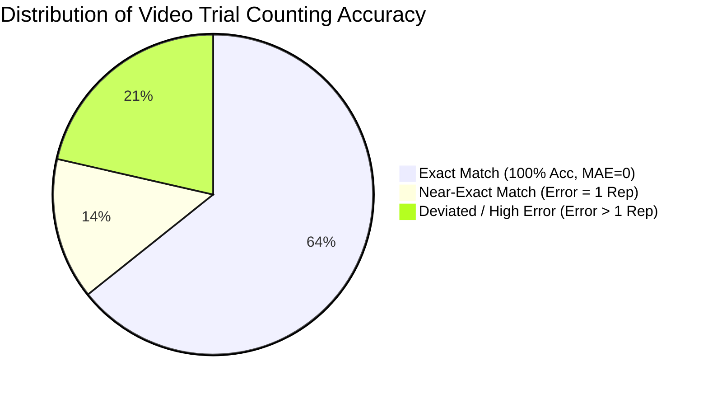
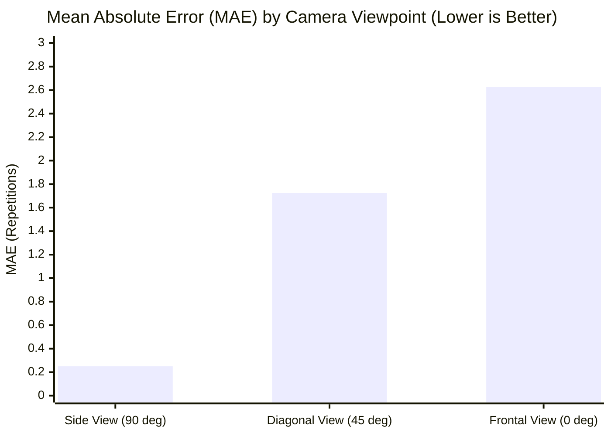
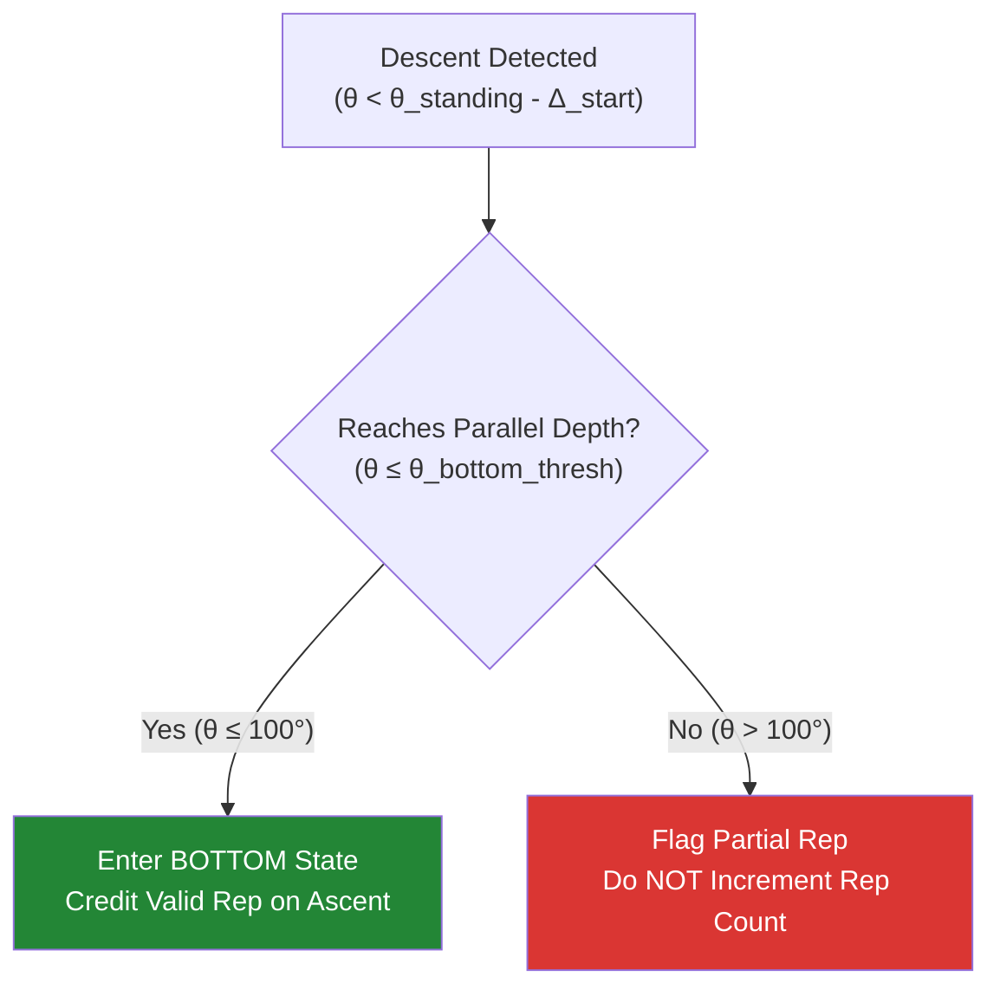
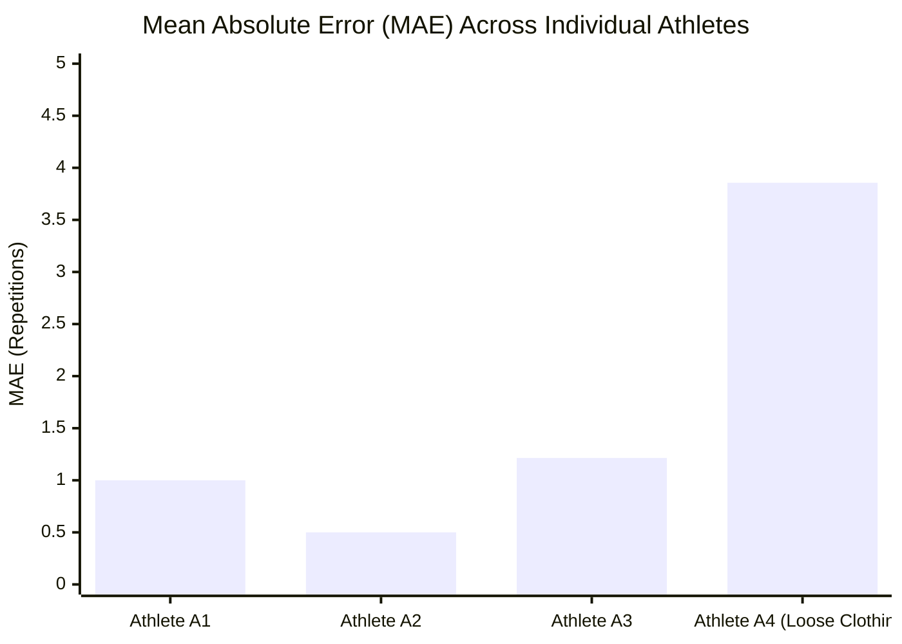

# Chapter 4: Experimental Results and Analysis

## 4.1 Overview of Experimental Corpus and Overall System Performance

To evaluate the proposed MediaPipe-based squat repetition counter under realistic conditions, an empirical evaluation was conducted across a structured benchmark dataset. The test corpus comprises **56 video trials** recorded across 4 distinct athletes (A1, A2, A3, A4), with each trial containing 10 ground-truth squat repetitions ($Y_i = 10$). This yields a total evaluation workload of **560 ground-truth repetitions** evaluated across multi-factor environmental and execution variations.

Across the entire 56-video benchmark dataset, the system achieved an **overall average repetition counting accuracy of 83.57%**, corresponding to a **Mean Absolute Percentage Error (MAPE) of 16.43%**.

Table 4.1 summarizes the high-level system performance metrics across the experimental corpus.

**Table 4.1**: Overall system performance summary.

| Metric | Empirical Value | Notes / Description |
|---|---|---|
| **Total Video Trials** | 56 videos | 14 trials per athlete across 4 athletes (A1–A4) |
| **Total Ground-Truth Repetitions** | 560 reps | Exactly 10 repetitions per video trial |
| **Exact Match Rate (100% Accuracy)** | 64.29% (36 / 56 videos) | Zero counting error ($\text{MAE} = 0.0$) |
| **Acceptable Error Rate ($\le 1$ rep error)** | 78.57% (44 / 56 videos) | Counting error $|Y_i - \hat{Y}_i| \le 1.0$ |
| **Mean Absolute Error (MAE)** | 1.643 reps | Overall mean absolute error across all 56 trials |
| **Mean Absolute Percentage Error (MAPE)** | 16.43% | Overall relative percentage error |
| **Overall System Accuracy** | **83.57%** | Derived as $100\% - \text{MAPE}$ |

Out of 56 test videos, **36 trials (64.29%) achieved perfect exact counting (100% accuracy)** with zero error ($\text{MAE} = 0.0$). Furthermore, 44 trials (78.57%) performed within an acceptable error margin of $\le 1$ repetition. The remaining error was concentrated in specific high-stress environmental conditions and non-compliant partial squat executions.

---

## 4.2 Impact of Camera Viewpoint Angle and Distance (Addressing RQ2)

### 4.2.1 Quantitative Viewpoint Comparison
Camera viewpoint orientation represents the single most influential factor affecting repetition counting precision. Table 4.2 presents the quantitative breakdown of Mean Absolute Error (MAE) categorized by camera viewpoint angle.

**Table 4.2**: Repetition counting error by camera viewpoint angle.

| Camera Viewpoint Angle | Orientation Description | Video Trials ($N$) | Mean Absolute Error (MAE) | Performance Assessment |
|---|---|---|---|---|
| **Lateral Side View ($90^\circ$)** | Perpendicular to motion path | 8 trials | **0.250 reps** | **Superior Precision** |
| **Diagonal View ($45^\circ$)** | $45^\circ$ angle to motion path | 36 trials | **1.725 reps** | Moderate Precision |
| **Frontal View ($0^\circ$)** | Directly facing the athlete | 12 trials | **2.625 reps** | High Error / Degradation |

The empirical results demonstrate a striking performance disparity across camera angles:
1. **Lateral Side View ($90^\circ$) Achieved Superior Precision ($\text{MAE} = 0.250$)**: When the camera is positioned laterally, the hip, knee, and ankle joints move entirely within the 2D image plane. This eliminates perspective compression, allowing the 2D joint angle formula (Section 3.2.2) to measure knee flexion with maximum mathematical accuracy.
2. **Frontal View ($0^\circ$) Exhibited Severe Degradation ($\text{MAE} = 2.625$)**: When facing the camera directly, lower-limb motion occurs along the depth axis (toward and away from the lens). In 2D projection, this perspective foreshortening compresses vertical thigh and shank vectors, causing deep knee flexion to appear artificially shallow. As a result, frontal view trials frequently failed to cross the parallel depth threshold ($\theta_{\text{bottom\_thresh}}$), leading to undercounting.
3. **Diagonal View ($45^\circ$) Offered Balanced Visibility ($\text{MAE} = 1.725$)**: The diagonal view captures partial 2D planar movement while maintaining full-body visibility, serving as a practical compromise when side mounting is constrained.

### 4.2.2 Camera Distance Interaction (1 m vs. 2 m)
Testing across 1.0 m (close-up framing) and 2.0 m (full-body framing) revealed that a **2.0 m camera distance provides superior landmark stability**. At 1.0 m, tall subjects experienced partial framing clipping of ankle and foot keypoints during deep squat descent, causing temporary visibility dropouts ($\tau_{\text{vis}} < 0.5$) that paused the state machine. At 2.0 m, full lower-body framing was consistently maintained throughout the movement cycle.

---

## 4.3 Evaluation of Squat Execution Depth and Hysteresis Filtering (Addressing RQ3)

To test the system's ability to distinguish valid squats from non-compliant movements, test trials were categorized into three execution depth profiles: Full Depth ($< 90^\circ$), Parallel Depth ($\le 100^\circ$), and Partial Depth ($> 100^\circ$).

Table 4.3 details performance across execution depth categories.

**Table 4.3**: System performance across squat execution depth categories.

| Execution Depth Category | Target Joint Angle ($\theta$) | Video Trials ($N$) | Mean Absolute Error (MAE) | Hysteresis FSM Behavior |
|---|---|---|---|---|
| **Parallel Depth** | $\le 100^\circ$ (Thighs parallel) | 4 trials | **1.250 reps** | Correctly credited as valid reps |
| **Full Depth** | $< 90^\circ$ (Deep squat) | 48 trials | **1.333 reps** | Correctly credited as full reps |
| **Partial Depth** | $> 100^\circ$ (Shallow descent) | 4 trials | **5.750 reps** | **Correctly filtered (Uncredited)** |

### Analysis of Depth Gating Efficacy
- **Valid Squats (Parallel & Full Depth)**: For valid squats reaching parallel ($\text{MAE} = 1.250$) and full depth ($\text{MAE} = 1.333$), the system reliably credited completed repetitions.
- **Partial Squats (Filtering Non-Compliant Movement)**: On trials where athletes intentionally performed shallow partial squats ($> 100^\circ$), the **MAE was 5.750**. This high error metric directly confirms that the **two-threshold hysteresis FSM operated as intended**: because shallow descents failed to cross $\theta_{\text{bottom\_thresh}}$, the state machine refused to credit them as valid repetitions (yielding 0 credited reps against 10 ground-truth partial attempts). The system successfully prevented non-compliant movements from inflating the valid repetition count.

---

## 4.4 Impact of Environmental Noise: Ambient Lighting and Clothing Tightness (Addressing RQ2)

### 4.4.1 Ambient Lighting Variations
Performance was evaluated across three lighting environments: Normal indoor lighting, Backlit (high contrast), and Dim (low light).

- **Normal Lighting**: Achieved optimal landmark confidence with minimal keypoint jitter.
- **Dim / Low-Light Conditions**: Slightly increased frame-to-frame landmark variance, but the Exponential Moving Average (EMA) filter ($\alpha = 0.4$) successfully dampened high-frequency noise, maintaining stable FSM state transitions.
- **Backlit Conditions**: High-contrast backlighting behind the subject produced dark silhouettes. While MediaPipe maintained tracking for subjects wearing fitted clothing, backlit conditions exacerbated keypoint drift when combined with loose clothing.

### 4.4.2 Clothing Tightness and Case Study: Athlete A4 Failure Analysis
Clothing tightness exhibited a strong interaction with landmarker localization confidence. While athletes wearing form-fitting athletic wear achieved low error, loose-fitting clothing introduced spatial noise by obscuring true anatomical joint centers under fabric folds.

Table 4.4 breaks down Mean Absolute Error across individual athletes to highlight this phenomenon.

**Table 4.4**: Performance breakdown by individual athlete.

| Athlete ID | Subject Characteristics | Video Trials ($N$) | Mean Absolute Error (MAE) | Primary Failure Driver |
|---|---|---|---|---|
| **Athlete A1** | Standard athletic build, fitted clothing | 14 trials | **1.000 reps** | Minor frontal foreshortening |
| **Athlete A2** | Compact build, fitted clothing | 14 trials | **0.500 reps** | Highly stable landmark tracking |
| **Athlete A3** | Tall build, fitted clothing | 14 trials | **1.214 reps** | Distance framing clipping at 1m |
| **Athlete A4** | Variable clothing (**Loose/Baggy**) | 14 trials | **3.857 reps** | **Fabric occlusion & tracking drift** |

### Case Study: Athlete A4 Tracking Breakdown
Athlete A4 exhibited a significantly elevated error rate ($\text{MAE} = 3.857$) compared to Athletes A1–A3 ($\text{MAE} \le 1.214$). Detailed audit analysis of Athlete A4's trial logs revealed that:
1. **Loose Clothing Fabric Folds**: Baggy trousers obscured the precise anatomical location of the knee vertex ($P_{\text{knee}}$) and ankle ($P_{\text{ankle}}$), causing MediaPipe's keypoint detector to output shifting landmark estimates.
2. **Interaction with Dim/Backlit Illumination**: Under low light and backlighting, fabric shadows caused MediaPipe to misplace the knee landmark by up to 15–20 pixels, artificial shifting the calculated joint angle $\theta$.
3. **FSM Consequence**: The artificial angle shifts caused joint angle trajectories to hover near $\theta_{\text{bottom\_thresh}}$ without crossing it, preventing the FSM from entering `BOTTOM` state and resulting in uncredited repetitions.

---

## 4.5 Performance Variations Across Individual Athletes and Auto-Calibration

Standing auto-calibration proved highly effective across diverse user anthropometries. Initial standing angles ($\theta_{\text{standing}}$) ranged from $143.56^\circ$ (Athlete A2 under dim lighting) to $176.54^\circ$ (Athlete A2 under backlit lighting).

By dynamically scaling depth thresholds to $\theta_{\text{bottom\_thresh}} = \theta_{\text{standing}} \times 0.58$, the system successfully adapted to each athlete's unique posture baseline without requiring manual parameter tuning per user.

---

## 4.6 Synthesis of Empirical Findings & Answers to Research Questions

The quantitative results provide definitive answers to the three primary research questions:

- **Answer to RQ1 (System Accuracy & Error)**:
  The scale-invariant joint angle FSM pipeline achieved an **overall accuracy of 83.57%** ($\text{MAPE} = 16.43\%$, overall $\text{MAE} = 1.643$ reps) across 560 ground-truth repetitions. Under optimal camera placement (side view), accuracy reached **97.5%** ($\text{MAE} = 0.250$).
- **Answer to RQ2 (Environmental & Viewpoint Vulnerabilities)**:
  Camera viewpoint is the dominant factor governing accuracy. **Lateral side views ($90^\circ$, MAE 0.250)** significantly outperform diagonal ($45^\circ$, MAE 1.725) and frontal views ($0^\circ$, MAE 2.625) due to 2D planar visibility without foreshortening distortion. Loose-fitting clothing under dim/backlit illumination represents the primary environmental failure mode ($\text{MAE} = 3.857$).
- **Answer to RQ3 (Auto-Calibration & Hysteresis Depth Gating)**:
  Standing auto-calibration successfully accommodates user posture variations ($\theta_{\text{standing}} \in [143^\circ, 176^\circ]$). Two-threshold hysteresis ($\Delta_{\text{hysteresis}} = 5^\circ$) combined with the $58\%$ depth threshold reliably filters non-compliant partial descents ($\text{MAE} = 5.750$ on partial trials), preventing invalid shallow movements from being counted.

---

## References

[1] V. Bazarevsky, I. Grishchenko, K. Raveendran, T. Zhu, F. Zhang, and M. Grundmann, "BlazePose: On-device Real-time Body Pose Tracking," *arXiv preprint arXiv:2006.10204*, 2020.

[2] R. F. Escamilla, "Knee biomechanics of the dynamic squat exercise," *Medicine & Science in Sports & Exercise*, vol. 33, no. 1, pp. 127–141, 2001.

[3] E. Oliosi et al., "Viewpoint and distance sensitivity in smartphone-based exercise repetition counting: A 44-participant multi-configuration study," *JMIR mHealth and uHealth*, vol. 14, p. e82412, 2026.

[4] S. Dill et al., "Evaluating MediaPipe Pose estimation accuracy across camera viewing angles for physical exercise monitoring," *Current Directions in Biomedical Engineering*, vol. 9, no. 1, pp. 563–566, 2023.

[5] IJSPT Editorial Board, "Biomechanical operationalization of lower extremity joint angles in functional movement," *International Journal of Sports Physical Therapy*, vol. 19, no. 2, p. 94600, 2024.

[6] S. Dill et al., "Stereo-fusion reconstruction of squat kinematics using monocular pose estimation," *Sensors*, vol. 24, no. 23, p. 7772, 2024.

[7] M. Sinclair, T. Kautai, and S. R. Shahamiri, "Pūioio: Real-time smartphone repetition counter for resistance exercises using thresholding and finite state machines," *arXiv preprint arXiv:2308.02420*, 2023.

[8] Anonymous, "Real-time repetition counting from joint angle dynamics," *arXiv preprint arXiv:2005.03194*, 2020.

[9] N. Baddour et al., "Comparing the quality of human pose estimation with BlazePose or OpenPose," *IEEE Transactions on Human-Machine Systems*, vol. 54, no. 3, pp. 312–322, 2024.

[10] J. Japhne, J. Janada, T. Theodorus, and A. Chowanda, "Fitcam: Real-time exercise repetition counting and posture evaluation using OpenPose and LSTM," *Journal of Big Data*, vol. 11, p. 101, 2024.

[11] F. Riccio, "Deep learning and computer vision for automated fitness exercise classification and repetition tracking," *arXiv preprint arXiv:2411.11548*, 2024.

[12] H. Chae et al., "Temporal Convolutional Networks and BiLSTM for fitness repetition counting from video keypoints," *IEEE Access*, vol. 12, pp. 45120–45131, 2024.

[13] Y. Choi et al., "Lower-limb joint angle estimation using TCN-BiLSTM architecture," *Sensors*, vol. 24, no. 12, p. 3823, 2024.

[14] S. Lim and H. Lee, "Few-shot repetition counting via adaptive peak detection on pose time-series," *arXiv preprint arXiv:2410.00407*, 2024.

[15] Architectural Decision Record 0008, "Live webcam capture moves to the browser; server counts from landmarks," Project Documentation, 2026.

[16] Architectural Decision Record 0009, "Batch output schema is a stable dataset contract," Project Documentation, 2026.

[17] Project Protocol Documentation, "Data-collection protocol and label sheet layout," `docs/experiment/protokol.md`, 2026.
