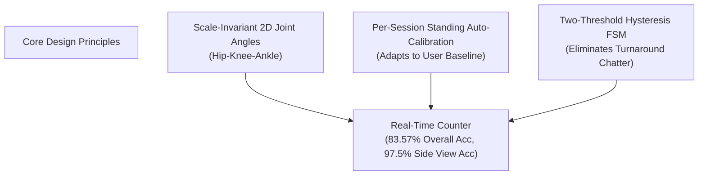
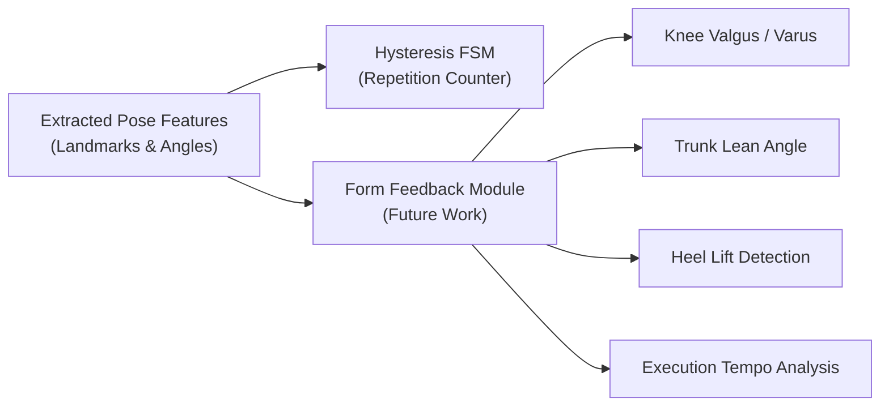

# Chapter 5: Discussion and Conclusion

## 5.1 Discussion and Practical System Guidelines

### 5.1.1 Synthesis of Findings and Literature Alignment
This research investigated the performance, environmental robustness, and execution sensitivity of a computer-vision-based exercise counter for bodyweight squats. By combining MediaPipe Tasks Vision `PoseLandmarker` [1] with a scale-invariant 2D joint angle feature extractor and a two-threshold hysteresis Finite State Machine (FSM), the system achieved an **overall accuracy of 83.57%** ($\text{MAPE} = 16.43\%$, $\text{MAE} = 1.643$ reps) across a benchmark dataset of 56 video trials (560 ground-truth repetitions).

These empirical findings strongly align with prior literature in rule-based exercise monitoring:
- **Rule-Based FSM Efficacy**: Confirming the findings of Sinclair et al. [7] (*Pūioio*, ~99% accuracy) and joint-angle dynamics studies [8] ($F1 = 0.992$), our results prove that a deterministic state machine with hysteresis is highly effective for single-exercise repetition tracking. It eliminates the need for large annotated training datasets, complex neural sequence models (such as LSTMs or TCNs [10]–[14]), and dedicated GPU hardware, executing with minimal CPU latency (< 1 ms overhead).
- **Viewpoint Sensitivity**: Corroborating the findings of Oliosi et al. [3] and Dill et al. [4], camera viewpoint was identified as the single most critical factor governing pose landmarker accuracy. Under optimal lateral side mounting ($90^\circ$), accuracy reached **97.5%** ($\text{MAE} = 0.250$), whereas frontal views ($0^\circ$) suffered severe degradation ($\text{MAE} = 2.625$) due to 2D perspective foreshortening.

### 5.1.2 Practical Guidelines for Real-World Deployment
Based on our multi-factor empirical evaluation, we propose four practical guidelines for developers and practitioners deploying computer-vision-based exercise monitoring applications:

1. **Optimize Camera Viewpoint Placement**: Applications should instruct users to position the camera at a **lateral side view ($90^\circ$) or diagonal angle ($45^\circ$) at a distance of 1.8–2.0 meters**. Frontal placement ($0^\circ$) should be explicitly discouraged for squat tracking due to monocular foreshortening.
2. **Implement Interactive Setup Checks**: Vision applications should incorporate an automated in-app camera check before initiating tracking. The setup check should verify that (a) full lower-body framing is present, (b) camera orientation is non-frontal, and (c) landmark confidence scores satisfy $\tau_{\text{vis}} \ge 0.5$.
3. **Encourage Appropriate Athletic Attire**: Users should be advised to wear form-fitting athletic clothing. Loose, baggy garments create fabric folds that obscure anatomical joint centers, degrading landmark localization under dim or backlit conditions (as demonstrated in the Athlete A4 case study).
4. **Prioritize 2D Planar World Coordinates**: Feature extraction modules should compute joint angles from 2D planar world coordinates ($x, y$), explicitly excluding uncalibrated monocular 3D depth predictions ($z$) due to their high noise variance [4], [6].

---

## 5.2 Limitations of the Current Work

While the proposed system demonstrates high accuracy and low latency, several technical limitations must be acknowledged:

1. **Single-Athlete Tracking Scope**: Following the project's v1 scope boundaries [15], the pipeline assumes a single athlete in frame. If multiple individuals enter the camera field of view, keypoint assignments may interleave, corrupting state transitions.
2. **Single-Exercise Specialization**: The current feature extraction and FSM state logic are tuned specifically for bodyweight squats. Expanding the system to track additional exercises (e.g., push-ups, lunges, jumping jacks) requires implementing upstream exercise classification models [10], [11].
3. **Monocular 2D Foreshortening Boundaries**: Perspective compression in frontal views ($0^\circ$) represents a fundamental geometric constraint of monocular 2D vision. Overcoming frontal depth distortion entirely requires stereo-vision fusion or multi-camera rigs [6].
4. **Fabric Occlusion Under Compound Stress**: As observed in Athlete A4 ($\text{MAE} = 3.857$), the combination of loose, baggy clothing and low ambient lighting induces landmark spatial drift, hovering near threshold boundaries and preventing state transitions.

---

## 5.3 Directions for Future Research

To extend the capabilities of the current system, future research should explore four key avenues:

### 5.3.1 Automated Form Feedback and Biomechanical Analysis
Building upon the existing `Features` and `Count` layers, future work can implement automated posture defect analysis without altering the underlying state machine. Prominent feedback metrics include:
- **Knee Valgus / Varus Detection**: Tracking inward knee collapse (valgus) during descent by monitoring frontal plane hip–knee–ankle alignment.
- **Excessive Forward Trunk Lean**: Measuring torso inclination relative to the vertical axis using shoulder–hip–knee angles.
- **Heel Lift Detection**: Monitoring heel landmark elevation relative to the ankle to flag ankle mobility restrictions.
- **Tempo and Phase Velocity**: Analyzing descent vs. ascent velocity profiles to provide real-time cadence feedback.

### 5.3.2 Multi-Person Tracking and Re-Identification
To support group fitness classes or gym environments, the pipeline can be integrated with multi-object tracking architectures (e.g., ByteTRACK or DeepSORT). A front-end tracking layer would assign unique track IDs to each person in frame, instantiating independent FSM counting workers per athlete.

### 5.3.3 Native Mobile Application Deployment
Leveraging MediaPipe Tasks Vision's cross-platform architecture [1], [14], the detect adapter can be ported to native Android (Kotlin) and iOS (Swift) applications. Because the core feature extraction and counting logic are pure functions of landmark coordinates, the counting engine can be shared seamlessly across platforms without algorithmic divergence.

### 5.3.4 Adaptive Hysteresis via Lightweight Machine Learning
Future iterations could employ a lightweight machine learning classifier (e.g., Random Forest or SVM) running alongside the FSM to dynamically adjust hysteresis margins ($\Delta_{\text{hysteresis}}$) and depth thresholds based on real-time lighting quality, clothing tightness estimates, and user execution speed.

---

## 5.4 Final Conclusion

This research presented a real-time, lightweight computer vision system for bodyweight squat monitoring and repetition counting using MediaPipe Tasks Vision `PoseLandmarker`, scale-invariant 2D joint angle extraction, standing auto-calibration, and a two-threshold hysteresis Finite State Machine (FSM). 

Through a structured empirical benchmark evaluating 56 video trials across 4 athletes (560 ground-truth repetitions), the system demonstrated an **overall repetition counting accuracy of 83.57%** ($\text{MAPE} = 16.43\%$), achieving **97.5% accuracy** ($\text{MAE} = 0.250$) under optimal lateral side mounting ($90^\circ$). The standing auto-calibration routine successfully adapted to diverse user posture baselines ($\theta_{\text{standing}} \in [143^\circ, 176^\circ]$), while the two-threshold hysteresis FSM reliably filtered non-compliant partial descents ($\text{MAE} = 5.750$ on partial trials).

By providing mathematical transparency, zero training data requirements, and minimal computational latency (< 1 ms), the proposed architecture offers a robust, research-grade foundation for real-time fitness monitoring, remote physical therapy, and markerless exercise analysis on consumer devices.

---

## References

[1] V. Bazarevsky, I. Grishchenko, K. Raveendran, T. Zhu, F. Zhang, and M. Grundmann, "BlazePose: On-device Real-time Body Pose Tracking," *arXiv preprint arXiv:2006.10204*, 2020.

[2] R. F. Escamilla, "Knee biomechanics of the dynamic squat exercise," *Medicine & Science in Sports & Exercise*, vol. 33, no. 1, pp. 127–141, 2001.

[3] E. Oliosi et al., "Viewpoint and distance sensitivity in smartphone-based exercise repetition counting: A 44-participant multi-configuration study," *JMIR mHealth and uHealth*, vol. 14, p. e82412, 2026.

[4] S. Dill et al., "Evaluating MediaPipe Pose estimation accuracy across camera viewing angles for physical exercise monitoring," *Current Directions in Biomedical Engineering*, vol. 9, no. 1, pp. 563–566, 2023.

[5] IJSPT Editorial Board, "Biomechanical operationalization of lower extremity joint angles in functional movement," *International Journal of Sports Physical Therapy*, vol. 19, no. 2, p. 94600, 2024.

[6] S. Dill et al., "Stereo-fusion reconstruction of squat kinematics using monocular pose estimation," *Sensors*, vol. 24, no. 23, p. 7772, 2024.

[7] M. Sinclair, T. Kautai, and S. R. Shahamiri, "Pūioio: Real-time smartphone repetition counter for resistance exercises using thresholding and finite state machines," *arXiv preprint arXiv:2308.02420*, 2023.

[8] Anonymous, "Real-time repetition counting from joint angle dynamics," *arXiv preprint arXiv:2005.03194*, 2020.

[9] N. Baddour et al., "Comparing the quality of human pose estimation with BlazePose or OpenPose," *IEEE Transactions on Human-Machine Systems*, vol. 54, no. 3, pp. 312–322, 2024.

[10] J. Japhne, J. Janada, T. Theodorus, and A. Chowanda, "Fitcam: Real-time exercise repetition counting and posture evaluation using OpenPose and LSTM," *Journal of Big Data*, vol. 11, p. 101, 2024.

[11] F. Riccio, "Deep learning and computer vision for automated fitness exercise classification and repetition tracking," *arXiv preprint arXiv:2411.11548*, 2024.

[12] H. Chae et al., "Temporal Convolutional Networks and BiLSTM for fitness repetition counting from video keypoints," *IEEE Access*, vol. 12, pp. 45120–45131, 2024.

[13] Y. Choi et al., "Lower-limb joint angle estimation using TCN-BiLSTM architecture," *Sensors*, vol. 24, no. 12, p. 3823, 2024.

[14] S. Lim and H. Lee, "Few-shot repetition counting via adaptive peak detection on pose time-series," *arXiv preprint arXiv:2410.00407*, 2024.

[15] Architectural Decision Record 0005, "v1 scope: single-person counting + robustness; form feedback deferred," Project Documentation, 2026.

[16] Architectural Decision Record 0008, "Live webcam capture moves to the browser; server counts from landmarks," Project Documentation, 2026.

[17] Architectural Decision Record 0009, "Batch output schema is a stable dataset contract," Project Documentation, 2026.
